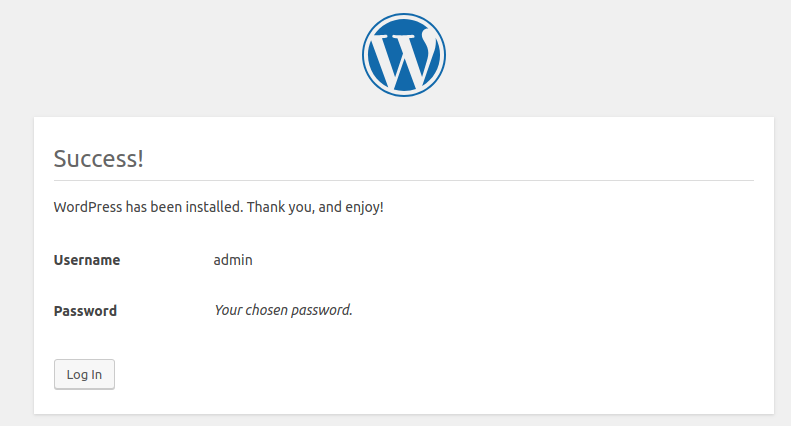

## Deploying Wordpress Site using Ansible and CloudFormation

We deploy a wordpress site using Ansible and CloudFormation Template. Following are the softwares must be installed.

Pre-Requisites:
- git
- python-boto
- ansible

We buid the following stack
  - 1 VPC
      - Creates a default "Main Route Table", "Security Group".
  - 1 Public Subnet inside VPC
  - 1 Security Groups (WebServer)
      - WebServerSecurityGroup : Allows traffic on SSH (22) and HTTP(80) ports   
  - 1 EC2 Instance for WebServer ( Public Subnet )  
  - 1 Interet Gateway
  - 1 Route Table and 1 Route for the internet attached to the Public Subnet

### Instructions to Use (For Linux-Ubuntu Users)

Lets first create a keypair by logging into our amazon console. Remember the name of the keypair. We will use the created keypair to ssh into ec2 instances.

Next lets setup the credentials which we will use to provision resources. You need the `access_key` and `secret_access_key`
Create a folder name `.aws` in your home directory, using the following command

```
mkdir ~/.aws/
```

Next create `credentails` file in `~/.aws/` folder, using

```
touch credentials
```

Now lets add our keys to the credentials file. Replace `your_access_key` and `your_secret_access_key` with the keys provided to you. Add these lines in your credentials file.

```
[default]
aws_access_key_id=your_access_key
aws_secret_access_key=your_secret_access_key
```

Now lets download this repository. Run

```
git clone https://repourl
```

Add the following to file `/etc/ansible/hosts`

```
[local]
localhost
```

Then,

```
cd cloned-repo-directory/
```

and provision the stack run the following,

```
ansible-playbook -i /etc/ansible/hosts wordpress.yml --verbose
```

Once the stack creation is complete open your browser and goto  (replace WebServerPublicIp with your WebServers IP)

```
http://WebServerPublicIp/wordpress/wp-admin/install.php
```

Next, after you select the language of your choice, enter your details 


Now you are done. You will see the following,



